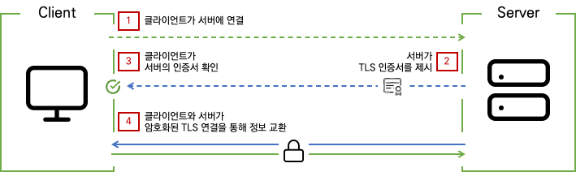
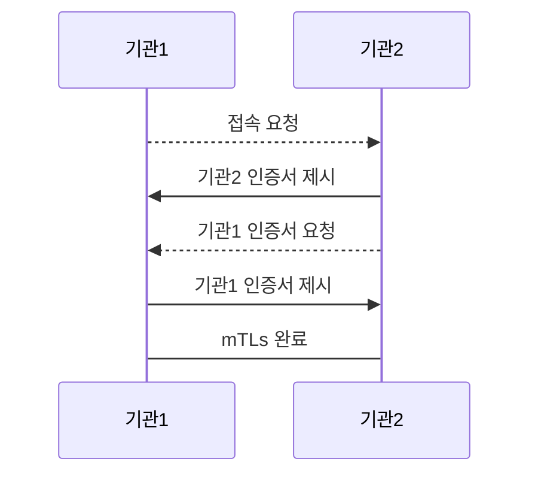
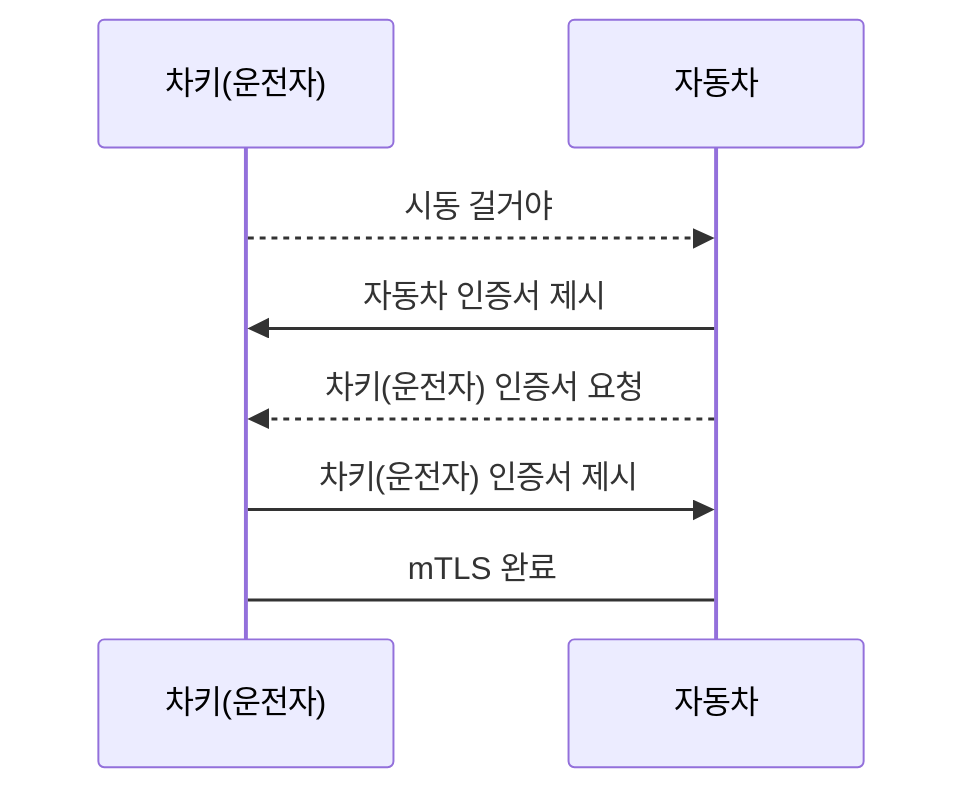

# mTLS

생성일: 2023년 3월 30일 오전 11:22

# mTLS (Mutal TLS)

---

## 1. SSL → TLS

SSL (Secure Sockets Layer, 보안 소켓 계층)은 클라이언트와 서버간의 전송된 데이터를 암호화하여 보안을 유지하는 표준기술

TLS (Transport Layer Securty, 전송 보안 계층)는 SSL에서 더 발전된 보안기술

- TLS 1.3 (최신)
    - hanshake 과정을 최소화해 HTTPS 통신의 보안과 속도 개선
    - handshake 최대한 암호화
    - 키 교환과 암호화 방식을 Cipher Suite를 통해 묶어서 정하지 않고 개별적 지정
    - 정적인 RSA와 Diffie-Hellman Cipher Suite 제거

handshake : TLS인증서 - 서버의 개인 키 소유 확인 프로세스

Cipher Suite: 전송 계층 보안에서 쓰는 보안 보조 알고리즘 

RSA : 공개키 암호화 시스템 

## 2. TLS handshake



TLS 

## 3. mTLS handshake


mTLS

- TLS : 클라이언트가 누구든 상관없이, 서버의 인증서만 유효한지 검증하는 인증
- mTLS: 서버의 인증서 + 접속하려는 클라이언트도 **서로** 인증이 필요한 방식
    - 상호 신뢰 확인을 위한 업계 표준

## 4. mTLS의 필요성

- 기관 - 기관 간의 접속 (금융권 및 사내시스템과 외부 연계 등)
- IOT
    - 예 : 자동차 시동을 걸고 접속하려는 당신이 검증된 운전자인지 확인





## 5. mTLS 장단점

- 장점
    - 상호 인증된 서버와 클라이언트간 통신을 이루어 안전성, 보안성 향상
- 단점
    - 양측 전부 인증서가 영구적이지 않아 관리에 대한 노력, 비용 필요
    - 어플리케이션과 서버에 추가 설정으로 인한 복잡성 증가

→ **Vault PKI Secert engine, Vault Agent를 통해 mTLS Automation을 구현하여 효율적인 mTLS 인증서 관리 도모**

# OpenSSL로 mTLS 만들어보기 (ubuntu linux)

---

## 1-1. Root key 생성

```go
openssl genrsa -out root.key 2048

// root 권한이 필요하므로 chmod 600 root.key 가 필요할 수 있다.
```

## 1-2. Root CA 요청서 (CSR) 생성

```go
openssl req -config ca.conf -extensions usr_cert -new -key root.key -out ca.csr
```

- ca.conf 의 [usr_cert] 부분을 참조해 root.key 기반의 csr파일(root ca 요청서)을 생성한다

---

ca.conf 파일

```go
[ req ] 
default_bits = 2048 
prompt = no
default_md = sha256 
distinguished_name = dn
x509_extensions = v3_ca # The extentions to add to the self signed cert
req_extensions  = v3_req
x509_extensions = usr_cert

[dn]
C = KR
ST = Seoul
L = Seoul
O = COMPANY
OU = DEV
emailAddress = example@example.com
CN = example root

[ usr_cert ]
basicConstraints = CA:TRUE
nsComment = "OpenSSL Generated Certificate"

[ v3_req ]
basicConstraints = CA:TRUE
```

- 참조 [https://gist.github.com/Soarez/9688998](https://gist.github.com/Soarez/9688998)

```go
 
[ req ] // main section
default_bits = 2048 
// default key size. default값은 512, -new 옵션으로 override
prompt = no
// prompt=no 설정시 certificates filed로 보내지 않고 오직 config file value를 가져오기만 한다.
default_md = sha256 
// digest 알고리즘을 특정한다 sha-1은 중단, sha-2만 지원한다
distinguished_name = dn
// 인증서 만들때 distinguished_name 설정
x509_extensions = v3_ca # The extentions to add to the self signed cert
req_extensions  = v3_req // 추가할 req section 
x509_extensions = usr_cert // 추가할 x509 section, self-signed에 사용함 
```

- extensions 에 있는 표준 요소들
    - `Subject Key Identifier` → entity가 여러 서명키를 갖고 있을때 식별하기 위해 사용
    - `Authority Key Identifier`  → entity가 여러 서명키를 갖고 있을때 식별하기 위해 사용
    - `Subject Alternative Name`→ 추가적인 DNS, IP 주소
    - `Basic Constraints` → 인증서가 CA인지 여부

---

```go
// 확인 
openssl req -text -in ca.csr

Certificate Request:
    Data:
        Version: 1 (0x0)
        Subject: C = KR, ST = Seoul, L = Seoul, O = COMPANY, OU = DEV, emailAddress = example@example.com, CN = example root
        Subject Public Key Info:
            Public Key Algorithm: rsaEncryption
                RSA Public-Key: (2048 bit)
....
Requested Extensions:
            X509v3 Basic Constraints:
                CA:TRUE
    Signature Algorithm: sha256WithRSAEncryption
....
```

## 1-3. Root CA 인증서 생성

csr을 활용해 root ca 생성하고 self-sign 한다.

```go
openssl x509 -req -days 3650 -in ca.csr -signkey root.key -extfile ca.ext -out ca.crt
```

- 인증서 기간 3650일
- root.key로 self-sign한 인증서를 ca.crt파일로 출력 (ca.csr로 요청, ca.ext로 추가정보 입력)

```go
// 확인 
openssl x509 -text -noout -in ca.crt
Certificate:
    Data:
        Version: 3 (0x2)
        Serial Number:
            73:fd:40:bd:39:0b:7e:c4:de:a8:cb:b0:6c:b2:2f:71:56:93:7e:cb
        Signature Algorithm: sha256WithRSAEncryption
        Issuer: C = KR, ST = Seoul, L = Seoul, O = COMPANY, OU = DEV, emailAddress = example@example.com, CN = example root
        Validity
            Not Before: Apr  4 01:49:54 2023 GMT
            Not After : Apr  1 01:49:54 2033 GMT
        Subject: C = KR, ST = Seoul, L = Seoul, O = COMPANY, OU = DEV, emailAddress = example@example.com, CN = example root
        Subject Public Key Info:
            Public Key Algorithm: rsaEncryption
                RSA Public-Key: (2048 bit)
...
X509v3 extensions:
            X509v3 Basic Constraints:
                CA:TRUE
    Signature Algorithm: sha256WithRSAEncryption
...
```

## 2-1. 서비스 A key 생성

서비스 A key 생성 

```go
openssl genrsa -aes256 -out service-a-with-pw.key 2048 
// -aes256 옵션으로 encrypt data, passwd 입력 필요

openssl rsa -in service-a-with-pw.key -out service-a.key
//패스워드 없는 key파일로 변경
```

## 2-2 서비스 A CSR 생성

서비스 A 인증서 생성을 위한 요청서 (CSR) 생성

```go
openssl req -new -key service-a.key -config service-a.conf -out service-a.csr
```

```go
cat service-a.conf

[req]
default_bits = 2048
prompt = no
default_md = sha256
distinguished_name = dn

[ dn ]
C=KR
ST=Seoul
L=Seoul
O=COMPANY
OU=DEV
emailAddress=example@example.com
```

- service-a.conf 파일을 바탕으로 service-a.csr 파일 생성

## 2-3. 서비스 A 인증서 생성

root ca 인증서와 key를 사용해 서비스 A 인증서를 root ca에 종속되도록 설정하여 인증서 생성 

```go
openssl x509 -req -days 365 -in service-a.csr -extfile service-a.ext -CA ca.crt -CAkey root.key -CAcreateserial -out service-a.crt
```

- `-days` : 365일 인증서 기간
- `-in` : service-a.csr 참조
- `-extfile` : 추가 정보 첨부
- `-CA` : root ca 인증서 지정
- `-CAkey` : root ca의 key 지정
- `-CAcreateserial` : root ca로 인증서 serial 생성

```go
//확인
openssl x509 -text -in service-a.crt

Certificate:
    Data:
        Version: 3 (0x2)
        Serial Number:
            ec:71:b0:dd:72:c2:a2:52
        Signature Algorithm: sha256WithRSAEncryption
        Issuer: C = KR, ST = Seoul, L = Seoul, O = COMPANY, OU = DEV, emailAddress = example@example.com, CN = example root
        Validity
            Not Before: Apr  4 02:11:58 2023 GMT
            Not After : Apr  3 02:11:58 2024 GMT
        Subject: C = KR, ST = Seoul, L = Seoul, O = COMPANY, OU = DEV, emailAddress = example@example.com, CN = service-a.example.com
        Subject Public Key Info:
            Public Key Algorithm: rsaEncryption
                RSA Public-Key: (2048 bit)
...
X509v3 extensions:
            X509v3 Subject Alternative Name:
                DNS:service-a.example.com
    Signature Algorithm: sha256WithRSAEncryption
...
```

## 3. 서비스 B 인증서 생성

서비스 A와 동일하게 서비스 B 인증서 생성

```go
openssl genrsa -aes256 -out service-b-with-pw.key 2048
openssl rsa -in service-b-with-pw.key -out service-b.key
openssl req -new -key service-b.key -config service-b.conf -out service-b.csr
openssl x509 -req -days 365 -in service-b.csr -extfile service-b.ext -CA ca.crt -CAkey root.key -CAcreateserial -out service-b.crt

//확인
openssl x509 -text -in service-b.crt

Certificate:
    Data:
        Version: 3 (0x2)
        Serial Number:
            ec:71:b0:dd:72:c2:a2:53
        Signature Algorithm: sha256WithRSAEncryption
        Issuer: C = KR, ST = Seoul, L = Seoul, O = COMPANY, OU = DEV, emailAddress = example@example.com, CN = example root
        Validity
            Not Before: Apr  4 02:19:57 2023 GMT
            Not After : Apr  3 02:19:57 2024 GMT
        Subject: C = KR, ST = Seoul, L = Seoul, O = COMPANY, OU = DEV, emailAddress = example@example.com, CN = service-b.example.com
        Subject Public Key Info:
            Public Key Algorithm: rsaEncryption
                RSA Public-Key: (2048 bit)
...
X509v3 extensions:
            X509v3 Subject Alternative Name:
                DNS:service-b.example.com
    Signature Algorithm: sha256WithRSAEncryption
...
```

## 4-1. Demo App (Python) 실행을 위한 설정

```go
python3 --version
Python 3.8.10

pip --version
pip 20.0.2 from /usr/lib/python3/dist-packages/pip (python 3.8)

pip install requests flask
```

```go
vi /etc/hosts

127.0.0.1 localhost service-a.example.com service-b.example.com
```

---

### Flask

웹 개발을 위한 파이썬 프레임워크. Django보다 가볍고 필요한 기능만 라이트하게 개발하기 좋다.

- `app.run(debug=True)` : 해당 파일 코드가 수정될때마다 Flask가 변경을 인식하고 다시 시작한다.  내용을 바로 반영되서 결과를 확인하기 편리하다.

---

## 4-2. Run Services

서비스 A

```go
cd python_service_a
python3 main.py
```

서비스 B

```go
cd python_service_b
python3 main.py
```

---

### 서비스 별 [main.py](http://main.py)

```python
from flask import Flask, render_template, request, make_response
import ssl
import requests

src = "service-a"
src_port = 7443
des = "service-b"
des_port = 8443

app = Flask(__name__)

config = {
    "DEBUG": True  # run app in debug mode
}

app.config.from_mapping(config)

@app.route('/')
def hello():
    response = make_response(f'Hello from "{src}"', 200)
    response.mimetype = "text/plain"
    return response

@app.route('/w-mtls')
def withMTLS():
    try:
      result = requests.get(f'https://{des}.example.com:{des_port}',
        cert=(f'../cert/{src}.crt', f'../cert/{src}.key'),
        verify='../cert/ca.crt')
      print(result)
      msg = result.text

    except requests.exceptions.RequestException as e:
      msg = str(e)

    response = make_response(msg, 200)
    response.mimetype = "text/plain"
    return response

@app.route('/wo-cert-mtls')
def withOutCertMTLS():
    try:
      result = requests.get(f'https://{des}.example.com:{des_port}',
                            verify='../cert/ca.crt')
      print(result)
      msg = result.text

    except requests.exceptions.RequestException as e:
      msg = str(e)

    response = make_response(msg, 200)
    response.mimetype = "text/plain"
    return response

@app.route('/wo-ca-mtls')
def withOutCAMTLS():
    try:
      result = requests.get(f'https://{des}.example.com:{des_port}',
                            cert=(f'../cert/{src}.crt', f'../cert/{src}.key'))
      print(result)
      msg = result.text

    except requests.exceptions.RequestException as e:
      msg = str(e)

    response = make_response(msg, 200)
    response.mimetype = "text/plain"
    return response

# service-a
if __name__ == "__main__":
    app.debug = True
    ssl_context = ssl.create_default_context(purpose=ssl.Purpose.CLIENT_AUTH, cafile='../cert/ca.crt')
    ssl_context.load_cert_chain(certfile=f'../cert/{src}.crt', keyfile=f'../cert/{src}.key', password='')
    # ssl_context.verify_mode = ssl.CERT_REQUIRED 
    app.run(host="0.0.0.0", port=src_port, ssl_context=ssl_context, use_reloader=True, extra_files=[f'../cert/{src}.crt'])

# service-b
if __name__ == "__main__":
    app.debug = True
    ssl_context = ssl.create_default_context(purpose=ssl.Purpose.CLIENT_AUTH, cafile='../cert/ca.crt')
    ssl_context.load_cert_chain(certfile=f'../cert/{src}.crt', keyfile=f'../cert/{src}.key', password='')
    ssl_context.verify_mode = ssl.CERT_REQUIRED
    app.run(host="0.0.0.0", port=src_port, ssl_context=ssl_context, use_reloader=True, extra_files=[f'../cert/{src}.crt'])
```

- `ssl.create_default_context` : ssl context 정의. (root ca 파일로 정의)
- `ssl_context.load_cert_chain` : crt, key를 지정해 인증서 체인을 설정
- `ssl_context.verify_mode` : 인증서 검증 (서비스 A는 검증 X)
- [`app.run](http://app.run)(…extra_files=[f'../cert/{src}.crt']))` : 인증서가 변경될 때마다 새롭게 시작한다. `extra_files`에 갱신될 인증서 경로 설정.
- `@app.route('/w-mtls') def withMTLS():` root ca, service crt, service key 3가지 인증서 모두 사용
- `@app.route('/wo-cert-mtls') def withOutCertMTLS():` service crt, service key없이 인증
- `@app.route('/wo-ca-mtls') def withOutCAMTLS():` root ca 없이 인증

---

### 서비스 A

```go
curl https://service-a.example.com:7443
curl: (60) SSL certificate problem: self signed certificate in certificate chain
More details here: https://curl.haxx.se/docs/sslcerts.html

curl failed to verify the legitimacy of the server and therefore could not
establish a secure connection to it. To learn more about this situation and
how to fix it, please visit the web page mentioned above.
```

- 자체서명 인증서 때문에 발생하는 주의 문구

```go
curl --insecure https://service-a.example.com:7443
Hello from "service-a"
```

- `—insecure` : 무시하고 진행하여 응답 확인

### 서비스 B

```go
curl --insecure https://service-b.example.com:8443
curl: (55) OpenSSL SSL_write: Connection reset by peer, errno 104
```

- `ssl_context.verify_mode = ssl.CERT_REQUIRED` 설정으로 `—insecure` 옵션이 있더라도 인증서 검증이 반드시 필요

```go
curl --cacert ca.crt --key service-b.key --cert service-b.crt https://service-b.example.com:8443
Hello from "service-b"
```

- root ca, service-b key, service-b cert 모두 사용하여야 실행된다.

## 4.3 서비스 A, B 간의 mTLS 확인

---

### 인증서 모두 설정

서비스 A에서 B로 요청, 양쪽 모두 인증서 설정 

```go
curl --insecure https://service-a.example.com:7443/w-mtls
Hello from "service-b"
```

 

### Service Crt, Key 없이 (Without Cert)

A→B 요청, A의 인증정보 X

```go
curl --insecure https://service-a.example.com:7443/wo-cert-mtls

('Connection aborted.', OSError("(104, 'ECONNRESET')"))
```

### Root CA 없이 (Without CA)

A→B로 요청, root ca X

```go
curl --insecure https://service-a.example.com:7443/wo-ca-mtls

HTTPSConnectionPool(host='service-b.example.com', port=8443): Max retries exceeded with url: / (Caused by SSLError(SSLError("bad handshake: Error([('SSL routines', 'tls_process_server_certificate', 'certificate verify failed')])")))
```

# Vault setup and PKI를 통한 인증서 발급

---

Vault Binary : **[https://releases.hashicorp.com/vault/](https://releases.hashicorp.com/vault/)**

OpenSSL로 직접 mTLS를 만들었을때 공수와 절차가 많이 필요한 단점이 있음. Vault PKI를 통해 간편하게 인증서를 관리하자.

## 1. Run Vault , Set env

```go
// Vault dev 서버 실행, root token id = root
vault server -dev -dev-root-token-id=root

// Vault 서버 주소 환경변수 설정, root로 로그인
export VAULT_ADDR='http://127.0.0.1:8200'
vault login

Token (will be hidden): root
```

## 2. Enable PKI

```go
vault secrets enable pki

// vault default MAX Lease TTL = 32일, 10년으로 변경

vault secrets tune -max-lease-ttl=87600h pki
```

## 2-1. root CA 생성

```go
vault write pki/root/generate/internal \
    key_bits=2048 \
    private_key_format=pem \
    signature_bits=256 \
    country=KR \
    province=Seoul \
    locality=KR \
    organization=COMPANY \
    ou=DEV \
    common_name=example.com \
    ttl=87600h
```

[https://developer.hashicorp.com/vault/api-docs/secret/pki](https://developer.hashicorp.com/vault/api-docs/secret/pki)

- ket_bits : 키에 사용할 비트수
- private_key_format : 개인키를 marshell(정렬)하는 format 설정
- signature_bits : signature 알고리즘 비트 수
- country : 인증서의 C(국가) 값
- province : 인증서의 ST(state) 값
- locality : 인증서의 L(지역) 값
- organization : 인증서의 O(조직) 값
- ou : 인증서의 OU(Organization Unit) 값
- common_name : 인증서의 CN (주소) 값. 2개 이상의 CN이 필요하면 alt_names 로 지정

## 2-2. CRL 생성

인증서 및 Certificate Revocation List (인증서 해지 목록) Endpoint 경로 설정

```go
vault write pki/config/urls \
    issuing_certificates="http://127.0.0.1:8200/v1/pki/ca" \
    crl_distribution_points="http://127.0.0.1:8200/v1/pki/crl"
```

→ 인증서 발급 위치 설정 

## 2-3. Role 생성

```go
vault write pki/roles/example-dot-com \
    allowed_domains=example.com \
    allow_subdomains=true \
    max_ttl=72h
```

- allow_domains : 인증서를 발급할 도메인 주소
- allow_subdomains : allow_domain의 하위 주소 (와일드 카드 포함) 인증서 요청 여부
    - allow_domains가 example.com이면, *.example.com 인증서 요청 가능

## 2-4. 인증서 발급 테스트

```go
vault write pki/issue/example-dot-com \
    common_name=service-a.example.com
// allow_subdomains=ture로 설정하였기에, service-a.example.com 가능 
```

# Vault Agent를 통한 인증서 갱신 자동화

---

## 1.  Agent에 적용할 policy 생성

```go
$ cat pki_policy.hcl

# Enable secrets engine
path "sys/mounts/*" {
  capabilities = [ "create", "read", "update", "delete", "list" ]
}

# List enabled secrets engine
path "sys/mounts" {
  capabilities = [ "read", "list" ]
}

# Work with pki secrets engine
path "pki*" {
  capabilities = [ "create", "read", "update", "delete", "list", "sudo" ]

// pki 경로의 pki secret engine에 대한 모든 권한 부여

vault policy write pki pki_policy.hcl
```

- Vault Agent는 ‘나’ 같은 사용자라 생각
    
    
    |  | 나 | Agent |
    | --- | --- | --- |
    | 로그인 | Token, Userpass… | Approle, AWS, GCP … |
    | 정책 | root, default, user1… | 활용목적 policy (pki) |

## 2. Enable approle

```go
vault auth enable approle

vault write auth/approle/role/pki-agent \
    secret_id_ttl=120m \
    token_ttl=60m \
    token_max_tll=120m \
    policies="pki"
```

- pki policy 적용한 pki-agent role 생성

## 3. Role ID, Secret ID 발급 및 저장

```go
vault read auth/approle/role/pki-agent/role-id
vault write -f auth/approle/role/pki-agent/secret-id

//Vault Agent 실행시 필요한 role id, secret id 저장 
vault read -field=role_id auth/approle/role/pki-agent/role-id > roleid
vault write -f -field=secret_id auth/approle/role/pki-agent/secret-id > secretid
```

## 4. Template

- Vault Agent의 주요 기능 중 Template 활용
    1. Caching (저장)
    2. Template (생성)
    3. Auto Auth (자동 인증)
        
        ### Caching
        
        생성된 token, lease_id를 저장하는 기능
        
        token 생성이 잦을 때 유용함
        
        ### Template
        
        Auth-auth 단계에서 생성된 토큰을 활용해 시크릿을 rendering (생성) 함
        
        ### Auto Auth
        
        자동 인증
        

```go
cat ca-a.tpl

{{- /* ca-a.tpl */ -}}
{{ with secret "pki/issue/example-dot-com" "common_name=service-a.example.com" "ttl=2m" }}
{{ .Data.issuing_ca }}{{ end }
```

- service-a에 대한 템플릿
- `pki/issue/example-dot-com` 경로에서 `[service-a.example.com](http://service-a.example.com)` 주소의 인증서를 발급한다.
- `ttl=2m` : 2분마다 인증서 갱신

```go
cat vault_agnet.hcl

// Auto auth - approle method 에 대한 정보 
...
auto_auth {
  method  {
    type = "approle"
    config = {
      role_id_file_path = "roleid"
      secret_id_file_path = "secretid"
    }
  }
...

// ca-a.tpl을 렌더링 하는 template 설정
// ../cert/ca.crt 경로의 파일로 저장한다
template {
  source      = "ca-a.tpl"
  destination = "../cert/ca.crt"
}
```

## 5. Vault Agent 실행

```go
vault agent -config=vault_agent.hcl -log-level=debug
```

```go
2023-04-03T08:39:38.888Z [DEBUG] Found certificate and set lease duration to 120 seconds
2023-04-03T08:39:38.889Z [DEBUG] (runner) receiving dependency vault.write(pki/issue/example-dot-com -> 6f28060e)
2023-04-03T08:39:38.889Z [DEBUG] (runner) initiating run
2023-04-03T08:39:38.889Z [DEBUG] (runner) checking template 4903c0854a0a6bdcd74cf9219422748a
2023-04-03T08:39:38.889Z [DEBUG] (runner) rendering "ca-a.tpl" => "../cert/ca.crt"
2023-04-03T08:39:38.889Z [DEBUG] (runner) checking template a04612e63b9a03a45ef968a8984a23db
2023-04-03T08:39:38.889Z [DEBUG] (runner) rendering "cert-a.tpl" => "../cert/service-a.crt"
2023-04-03T08:39:38.889Z [DEBUG] (runner) checking template 850589d81f7afe64c7c5a0a8440c8569
2023-04-03T08:39:38.890Z [DEBUG] (runner) rendering "key-a.tpl" => "../cert/service-a.key"
2023-04-03T08:39:38.890Z [DEBUG] (runner) checking template 60e7f2683d2c76a501eb54879bf89ad2
2023-04-03T08:39:38.890Z [DEBUG] (runner) rendering "cert-b.tpl" => "../cert/service-b.crt"
2023-04-03T08:39:38.891Z [INFO] (runner) rendered "cert-b.tpl" => "../cert/service-b.crt"
2023-04-03T08:39:38.891Z [DEBUG] (runner) checking template 1fb22b9f15857b7eeb0b68a3c9ac6d20
2023-04-03T08:39:38.891Z [DEBUG] (runner) rendering "key-b.tpl" => "../cert/service-b.key"
2023-04-03T08:39:38.892Z [INFO] (runner) rendered "key-b.tpl" => "../cert/service-b.key"
2023-04-03T08:39:38.893Z [DEBUG] (runner) diffing and updating dependencies
2023-04-03T08:39:38.893Z [DEBUG] (runner) vault.write(pki/issue/example-dot-com -> 8f8bcb3e) is still needed
2023-04-03T08:39:38.893Z [DEBUG] (runner) vault.write(pki/issue/example-dot-com -> 6f28060e) is still needed
2023-04-03T08:39:38.893Z [DEBUG] (runner) watching 2 dependencies
2023-04-03T08:39:38.893Z [DEBUG] (runner) all templates rendered
```

1. 120초마다 렌더링 갱신
2. 경로내의 tpl 파일을 모두 렌더링하며 인증서 및 키파일을 생성한다 

```go
/vault-mtls-demo/python_service_a 
cat main.py

....
app = Flask(__name__)
....
if __name__ == "__main__":
...
    app.run(host="0.0.0.0", port=src_port, ssl_context=ssl_context, use_reloader=True, extra_files=[f'../cert/{src}.crt'])
```

1. [main.py](http://main.py) 코드의 extra_files가 참조하는 인증서 파일이 vault agent에 의해 자동으로 갱신되어 인증서를 120초마다 다시 읽어온다. 
2. 인증서를 읽어보면 유효기간이 2분마다 갱신됨을 확인할 수 있다.

```go
openssl x509 -in service-a.crt -noout -text
...
Validity
            Not Before: Apr  3 08:45:56 2023 GMT
            Not After : Apr  3 08:48:26 2023 GMT
...
```
